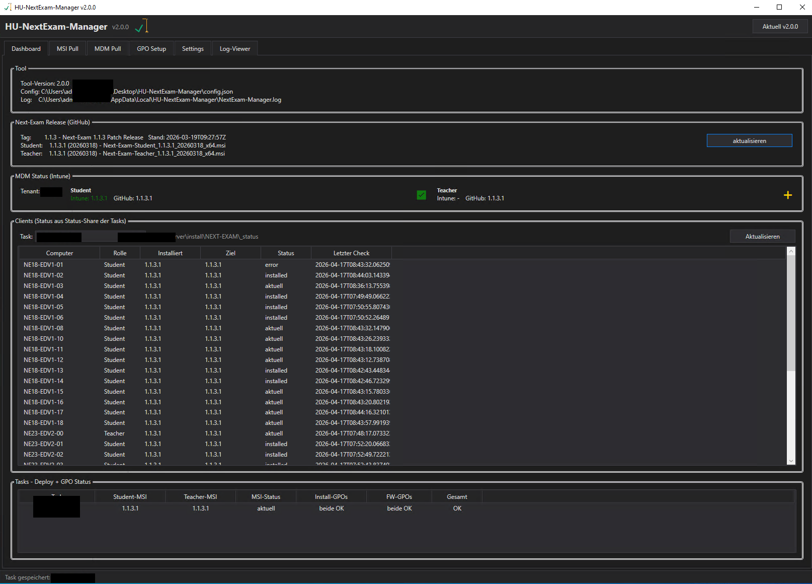
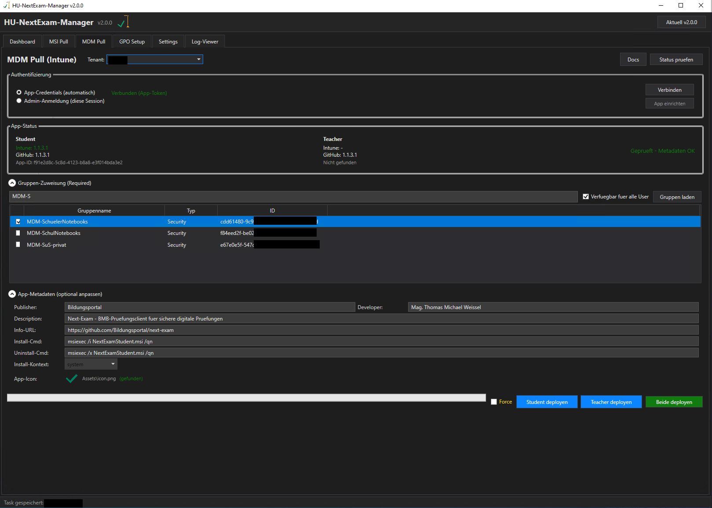

# HU-NextExam-Manager 

WPF-Tool (PowerShell 5.1) fuer die automatische Verteilung und Verwaltung von
[Next-Exam](https://github.com/Bildungsportal/next-exam) in Active-Directory-Umgebungen
und via Intune/MDM (Microsoft Graph API).

---

## Screenshots

| Dashboard | MDM Deploy (Intune) |
|:-:|:-:|
|  |  |

---

## Was macht das Tool?

In einer typischen Schulumgebung braucht jede Next-Exam-Version manuelle Arbeit:
MSI herunterladen, auf Shares kopieren, GPOs pflegen, Firewall-Regeln setzen,
WMI-Filter konfigurieren. Das Tool automatisiert den gesamten Prozess — einmal
konfiguriert, laeuft der Rest taeglich automatisch per Scheduled Task.

## Funktionen

- MSI-Download vom offiziellen Next-Exam GitHub-Release (Student + Teacher)
- Share-Management mit automatischer Archivierung alter Versionen
- GPO-Erstellung: Install-GPOs (Startup-Script) + Firewall-GPOs
- WMI-Filter fuer Student/Teacher-Trennung in derselben OU
- Auto-Pull per Scheduled Task (taeglich, unattended)
- MDM-Deployment: Win32 LOB App via Intune (Microsoft Graph API)
- Entra ID App Registration per In-App Setup-Wizard
- Dashboard mit Ampel-Status, Client-Uebersicht und MDM-Widget
- Self-Update, Log-Viewer, Multi-Task-Konfiguration, portable Config

---

## Installation

### Voraussetzungen

**GPO-Deployment (Active Directory):**

- Windows Server 2016+ oder Client mit RSAT
- PowerShell 5.1 (Standard in allen aktuellen Windows-Versionen)
- RSAT-Module: `GroupPolicy`, `ActiveDirectory`, `NetSecurity`
- Domain-Admin-Konto (oder delegierte GPO-Rechte)

**MDM-Deployment (Intune) — zusaetzlich:**

- Microsoft 365 Tenant mit Intune-Lizenzierung
- Globaler Administrator oder Intune Administrator Rolle
  (fuer Entra ID App Registration + Admin Consent)
- Intune-gemanagte Geraete (Autopilot oder manuell enrolled)
- Internetzugang vom Admin-Rechner (Graph API + Azure Blob Upload)

### Bootstrap-Install

Einmal pro Server. Als Domain-Admin-User:

```powershell
$d = Join-Path $env:USERPROFILE 'Desktop\HU-NextExam-Manager'
New-Item -ItemType Directory -Path $d -Force | Out-Null
Invoke-WebRequest "https://raw.githubusercontent.com/ChiliApple/HU-NextExam-Manager/main/Pull.ps1" `
    -UseBasicParsing -OutFile (Join-Path $d 'Pull.ps1')
cd $d; .\Pull.ps1
```

> **Hinweis:** Downloads laufen ueber `raw.githubusercontent.com` (kein API-Rate-Limit).
> Nur das Tree-Listing braucht 2 API-Calls pro Pull.

### Starten

Doppelklick auf **Start.vbs** - triggert UAC-Prompt (Tool braucht Admin fuer GPO),
laeuft dann fensterlos und das Tool-Fenster kommt nach ~3 Sekunden.

### Update

Im Tool: **Gold-Update-Button** oben rechts, wenn neue Version verfuegbar.
Oder manuell `.\Pull.ps1` ausfuehren (Tool vorher schliessen).

---

## Die Oberflaeche

Das Tool hat **sechs Tabs**:

### Dashboard
Die zentrale Uebersicht. Zeigt oben Tool-Info + den aktuellen GitHub-Release,
in der Mitte die **Clients** pro Task (welcher PC hat welche Version installiert?),
unten die **Tasks-Uebersicht** mit Ampel-Status (MSI aktuell? GPOs gesetzt?).

### MSI Pull
- Klick **"Release abfragen"** → Tool holt aktuelle Next-Exam Version von GitHub
- Klick **"Changelog..."** → Release-Notes als Markdown/Text speicherbar
- **Task markieren + "Auswahl aktualisieren"** → Download MSIs einmal nach TEMP,
  dann Copy auf den Student/Teacher-Share des Tasks. Alte MSIs landen in `_archive\`
  (nur die letzten 3 werden aufgehoben)
- **Auto-Pull-Checkbox**: Scheduled Task registrieren der taeglich laeuft
  - **SYSTEM** = laeuft ohne Anmeldung, braucht Machine-Account-Rechte auf Shares
  - **User** = laeuft nur bei Anmeldung, holt verpasste Zeiten beim Login nach

### MDM Deploy
Intune Win32-App-Deployment via Microsoft Graph API fuer Geraeteinitiative-Notebooks
(Autopilot/Intune-managed, kein Domain-Join).

- **Entra ID App Registration**: In-App Setup erstellt automatisch die benoetigte
  App Registration im Tenant (inkl. Permissions, Admin Consent, Client Secret)
- **Auth**: Client Credentials Flow (unattended) + Auth Code Flow mit PKCE (interactive)
- **Credential Store**: DPAPI-verschluesselte Secrets in `%APPDATA%\HU-NextExam\`
- **Packaging**: Automatischer Download von `IntuneWinAppUtil.exe`, MSI → `.intunewin`
- **Upload**: Chunked Azure Blob Upload (6 MB Blocks) fuer grosse Pakete
- **Win32 App CRUD**: Erstellen, Aktualisieren, Loeschen von Win32 LOB Apps via Graph beta
- **Gruppen-Zuweisungen**: Required + Available for enrolled devices
- **Dashboard-Widget**: Zeigt aktuelle GitHub-Release-Version vs. Intune-deployed Version
- **Status-Vergleich**: Metadaten-Diff (Version, Description, Icon, Detection Rules)

Voraussetzung: Entra ID App Registration pro Tenant - siehe **[Docs/MDM-Setup.md](Docs/MDM-Setup.md)**
oder den In-App-Setup-Button im MDM-Tab.

### GPO Setup
Oben die Tasks-Liste mit Status fuer alle 4 GPOs pro Task
(Install Student/Teacher + Firewall Student/Teacher).
Unten Detail-Panel mit allen Pfaden, Filtern, Rechten fuer den markierten Task.

Buttons:
- **Install-GPOs** → legt GPOs an mit Startup-Script (PowerShell, msiexec /quiet)
- **FW-GPOs** → Firewall-Regeln (App-Rules + optional Ports)
- **Mit OU verknuepfen** → GPO-Link zur OU aus dem Task
- **WMI-Filter cleanup** → entfernt alte WMI-Filter des Tasks (falls korrupt)
- **GPOs entfernen** → Remove-GPO fuer alle 4 GPOs des Tasks

### Settings
Multi-Task-Konfiguration (mehrere Deploy-Konfigurationen pro Server moeglich).
Pro Task:
- Domain, DC-Server
- Student-/Teacher-Share (UNC-Pfad)
- Status-Share (optional, fuer Client-Feedback)
- OU-Ziele (DistinguishedNames)
- WMI-Filter (siehe unten)
- GPO-Name-Praefix (Default: `HU-NEXT-EXAM-`)
- Firewall-Einstellungen (Profile, EXE-Pfade, optional Ports)

### Log-Viewer
Live-Ansicht von `%LOCALAPPDATA%\HU-NextExam-Manager\NextExam-Manager.log`.
Filter nach Level (DEBUG/INFO/WARN/ERROR), Volltext-Suche, Log loeschen.

---

## Erst-Setup

1. Tool starten → **Settings**-Tab
2. **"+ Neu"** → Task-Namen eingeben
3. Felder fuellen:
   - Domain FQDN z.B. `schule.local`
   - DC-Server (Hostname oder IP)
   - Student-Share UNC z.B. `\\FILESRV\install\NEXT-EXAM\Student`
   - Teacher-Share UNC z.B. `\\FILESRV\install\NEXT-EXAM\Teacher`
   - OU-Ziel Student+Teacher als **DistinguishedName**
     `OU=Workstations,OU=EDV,DC=schule,DC=local`
   - WMI-Filter (siehe unten)
   - GPO-Praefix bleibt bei `HU-NEXT-EXAM-`
4. **"Task speichern"**
5. **MSI Pull**-Tab → "Release abfragen" → Task markieren → "Auswahl aktualisieren"
6. **GPO Setup**-Tab → Task markieren → "Install-GPOs" → "FW-GPOs" → "Mit OU verknuepfen"
7. Client neu starten (oder `gpupdate /force` + Reboot) → MSI wird installiert

---

## WMI-Filter konfigurieren (Beispiel)

Wenn Student- und Teacher-PCs in **derselben OU** liegen, musst du ueber
WMI-Filter trennen welcher PC welche GPO bekommt.

### Typisches Szenario

Naming-Convention: Teacher-PC im Raum endet auf `-01` (z.B. `PC-EDV1-01`),
Schueler-PCs haben jede andere Nummer (`PC-EDV1-02`, `PC-EDV1-03`, ...).

### Settings eintragen

| Feld | Typ | Muster |
|------|-----|--------|
| WMI-Filter **Student** | `Custom` | `SELECT * FROM Win32_ComputerSystem WHERE NOT Name LIKE '%-01'` |
| WMI-Filter **Teacher** | `Custom` | `SELECT * FROM Win32_ComputerSystem WHERE Name LIKE '%-01'` |

### Regeln fuer das Muster-Feld

- **Einfache Anfuehrungszeichen** `'` (nicht doppelte `"`)
- **Keine Klammern** um den LIKE-Ausdruck
- **Typ `Custom`** wenn `NOT`, `AND`, `OR` vorkommt
- **Typ `Pattern`** reicht fuer reine LIKE-Faelle (Muster z.B. `%-01`)
- **Typ `Prefix`** fuer Hostname-Prefixe (Muster z.B. `PC-S` → `Name LIKE 'PC-S%'`)
- **Typ `List`** fuer explizite Liste (Muster z.B. `PC1,PC2,PC3`)

### Was passiert dann

Beim Klick auf **"Install-GPOs"** legt das Tool automatisch an:
- `HU-NEXT-EXAM-WMI Student` in AD (unter CN=SOM,CN=WMIPolicy,CN=System,...)
- `HU-NEXT-EXAM-WMI Teacher` in AD
- Verknuepft beide mit den jeweiligen Install- und Firewall-GPOs

### Filter-Muster aendern

Das Tool ueberschreibt keine bestehenden Filter. Bei Pattern-Aenderung:
1. **"WMI-Filter cleanup"** im GPO-Setup-Tab → loescht alte Filter des Tasks
2. **"Install-GPOs"** → legt frische Filter mit neuem Muster an

### Verifizieren in GPMC

- `WMI-Filter` Ordner → beide Filter sichtbar
- Einzelne GPO → Tab **"Geltungsbereich"** → Feld **"WMI-Filterung"** → zeigt den zugewiesenen Filter

---

## Auto-Pull automatisieren

**MSI Pull**-Tab → Checkbox **"Auto-Pull taeglich um HH:mm"**:
- Default `03:00` (anpassbar)
- **SYSTEM-Mode** empfohlen fuer produktiven Dauerbetrieb (braucht Share-ACL
  fuer Machine-Account `DOMAIN\<COMPUTERNAME>$`)
- **User-Mode** wenn Admin-Rechte nicht zentral konfigurierbar

Scheduled Task liegt unter `\HU-NextExam-Manager\AutoPull` (SYSTEM) oder
direkt im Root `\AutoPull` (User-Mode). Ruft das Tool mit `-AutoPull`-Flag
headless auf - skipped Tasks die bereits die aktuelle Version haben.

---

## Client-Status

Wenn pro Task ein **Status-Share** konfiguriert ist, schreibt das Client-
Startup-Script nach jedem Install-Check eine JSON-Datei zurueck:

```json
{
  "ComputerName": "PC-EDV1-01",
  "Role": "Teacher",
  "Installed": "1.1.3.1",
  "Target": "1.1.3.1",
  "LastCheck": "2026-04-15T03:02:14+02:00",
  "LastAction": "aktuell"
}
```

Im **Dashboard** siehst du alle Clients eines Tasks mit Status.

**Einrichtung:**
1. Settings → Task → **Status-Share-Pfad** eintragen (Default-Vorschlag wird
   aus dem Student-Share abgeleitet: `<Parent>\_status`)
2. Button **"Anlegen + ACL"** → legt Ordner an, setzt NTFS-ACL:
   - Domain-Computers: Write + Read (Clients koennen schreiben)
   - Domain-Admins: FullControl
   - Vererbung deaktiviert (nur dieser Ordner)
3. Install-GPOs neu erstellen → Startup-Script bekommt den Status-Pfad
4. Client-Reboot → JSON wird geschrieben → im Dashboard sichtbar

---

## Repo-Struktur

```
HU-NextExam-Manager/
├── HU-NextExam-Manager.ps1  # Main (WPF-UI, PS 5.1)
├── Pull.ps1                 # Self-Update / Bootstrap
├── Start.vbs                # Fensterloser Launcher (mit UAC-Elevation)
├── README.md                # Diese Datei
├── Assets/
│   ├── icon.ico
│   ├── icon.png
│   └── crane_check_icon.png
├── Docs/
│   ├── INSTALL.md
│   ├── MDM-Setup.md
│   ├── CHANGELOG.md
│   ├── NOTICE.md
│   ├── LICENSE
│   └── config.json.example
├── Modules/
│   ├── Config.psm1
│   ├── Logging.psm1
│   ├── MSIPull.psm1
│   ├── MDMDeploy.psm1
│   ├── WMIFilter.psm1
│   ├── GPOSetup.psm1
│   ├── AutoPull.psm1
│   └── ClientStatus.psm1
├── Templates/
│   └── Startup-NextExam.ps1  # Client-Startup-Script (via GPO deployed)
└── XAML/
    └── MainWindow.xaml
```

---


## Known Issues / Manuelle Nacharbeit

### 1. GPO "Nicht angewendet (Leer)" nach Install-GPOs erstellen

**Problem:** Nach dem Erstellen der Install-GPOs ueber das Tool zeigt `gpresult`
die GPOs als "Nicht angewendet (Leer)" an. Die Scripts-CSE erkennt die
programmatisch geschriebenen `scripts.ini` / `psscripts.ini` nicht als gueltig.

**Workaround (manuell, pro Install-GPO):**
1. GPMC oeffnen (`gpmc.msc`)
2. Die betroffene GPO finden (z.B. `HU-NEXT-EXAM-Student-Install`)
3. Rechtsklick → **Bearbeiten**
4. Computerkonfiguration → Windows-Einstellungen → **Skripts (Starten/Herunterfahren)**
5. **Starten** doppelklicken
6. Das CMD-Script (`Startup-NextExam.cmd`) sollte bereits gelistet sein
7. Einfach **OK** klicken (nichts aendern, nur bestaetigen)
8. Editor schliessen
9. Fuer **bei